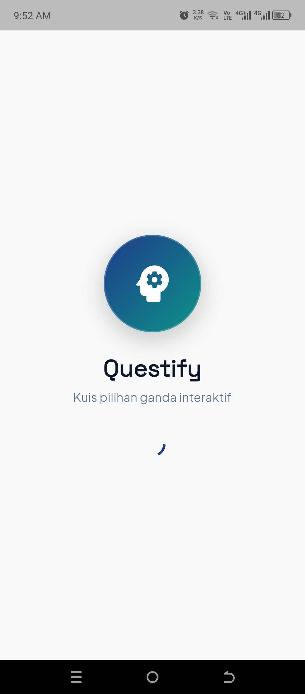
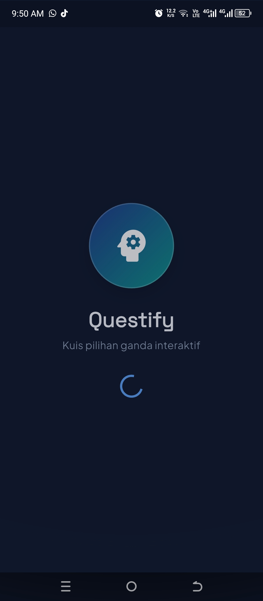
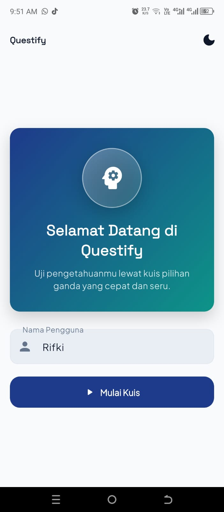
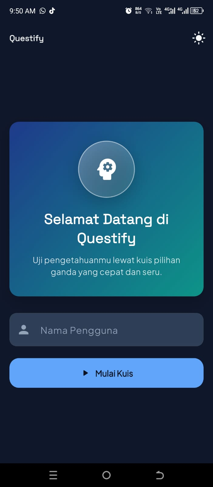
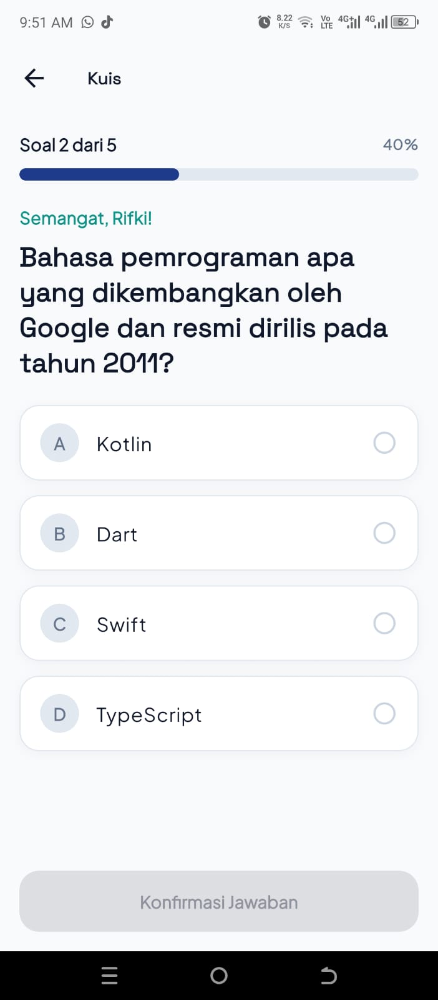
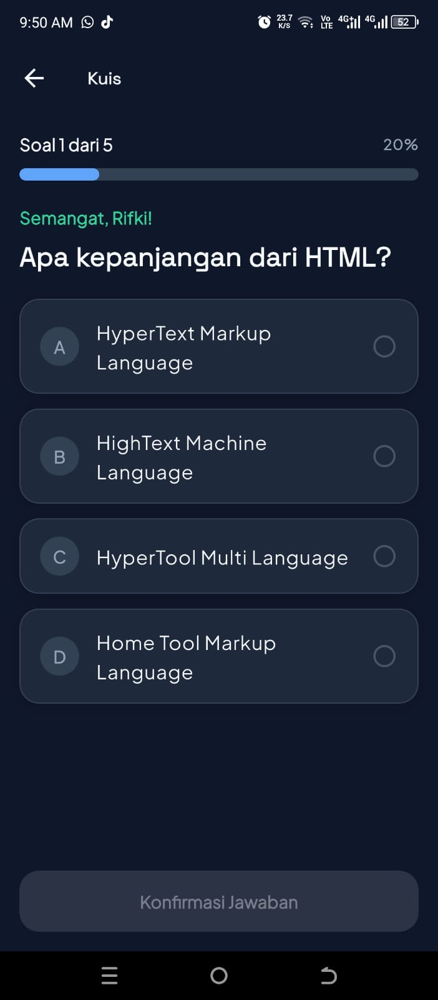
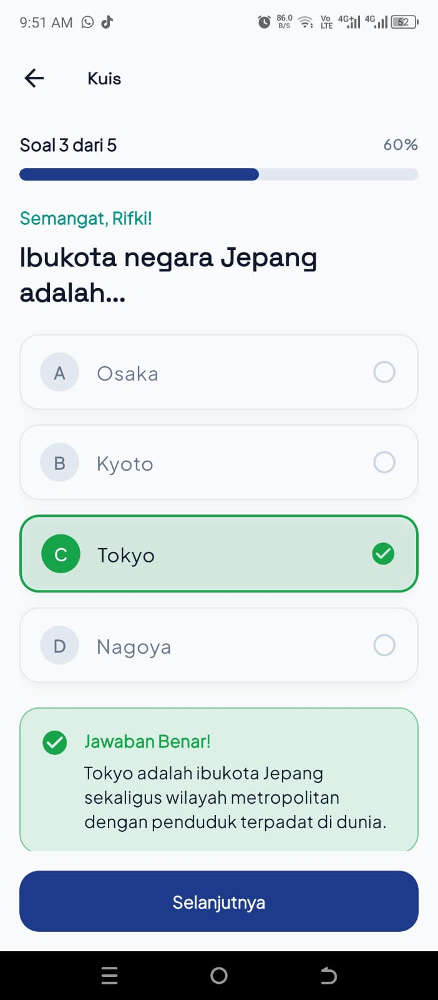
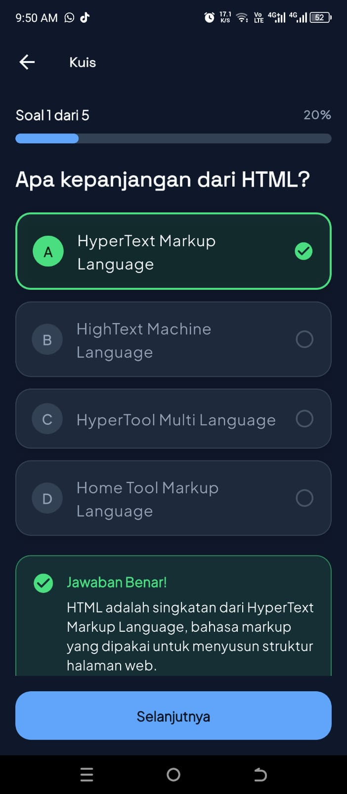
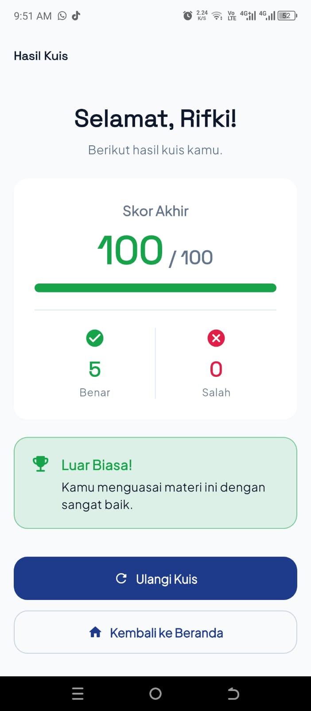
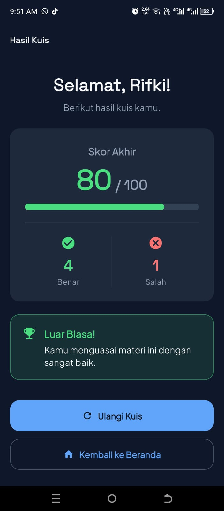

# 🧠 Questify

**Aplikasi Kuis Pilihan Ganda Interaktif** — dibangun dengan **Flutter** dan **Material 3**.
Proyek UTS Praktikum Pemrograman Mobile.

---

## 👤 Identitas Mahasiswa

| | |
|---|---|
| **Nama** | Rifki Al Sauqy |
| **NIM** | 241401007 |
| **Lab** | Lab 1 |
| **Mata Praktikum** | Pemrograman Mobile |

---

## 📱 Informasi Aplikasi

**Nama Aplikasi:** Questify

**Deskripsi Singkat:**
Questify adalah aplikasi kuis pilihan ganda yang interaktif. Pengguna memasukkan
nama, menjawab 5 soal, dan langsung melihat penjelasan setiap jawaban. Di akhir,
aplikasi menampilkan skor akhir, rincian jumlah benar/salah, serta pesan evaluasi
otomatis. Aplikasi mendukung **Light & Dark Mode**, tampilan yang **responsif**
untuk HP maupun tablet, dan **state management** yang menjaga progres jawaban
tetap aman saat layar dirotasi.

**Fitur yang Tersedia:**

- 🚀 **Splash Screen** dengan logo kustom (gradien + ikon) dan animasi.
- 🙋 **Input Nama Pengguna** dengan validasi (tidak boleh kosong, minimal 3 karakter).
- 🌗 **Dual Theme** — ganti Light/Dark Mode kapan saja lewat tombol di App Bar.
- 📝 **Kuis Pilihan Ganda** (5 soal) dengan kartu opsi A–D dan indikator warna:
  netral, terpilih (primary), benar (hijau), salah (merah).
- 📊 **Progress Bar Dinamis** yang menampilkan posisi soal (contoh: "Soal 3 dari 5").
- ✅ **Konfirmasi Jawaban + Penjelasan Otomatis** untuk setiap soal.
- 🏆 **Halaman Hasil** — skor akhir (0–100), rincian Benar vs Salah, dan pesan
  evaluasi otomatis berdasarkan skor.
- 🔄 **State Management Anti-Reset** — progres jawaban tidak hilang saat layar
  dirotasi (indeks soal, jawaban terpilih, dan skor tetap terjaga).
- 📐 **Responsive & Adaptive Design** — layout menyesuaikan ukuran layar
  (HP kecil, landscape, hingga tablet) tanpa overflow.
- 🧩 **Reusable Widget** — komponen UI dipisah ke file tersendiri
  (`AppLogo`, `OptionCard`, `QuizProgressBar`).

---

## 🎨 Dokumentasi

### Kredit Aset

| Aset | Sumber | Lisensi |
|---|---|---|
| Font **Plus Jakarta Sans** & **Space Grotesk** | [Google Fonts](https://fonts.google.com) | SIL Open Font License |
| Ikon (**Material Symbols** / Material Icons) | [Google Material Icons](https://fonts.google.com/icons) | Apache License 2.0 |
| Logo aplikasi Questify | Dibuat sendiri (SVG/PNG) | Milik sendiri |

> Tidak menggunakan gambar atau aset dari internet tanpa izin.

### 📸 Screenshot Tiap Halaman

**1. Splash Screen**

| Light Mode | Dark Mode |
| :---: | :---: |
|  |  |

**2. Halaman Welcome (Beranda)**

| Light Mode | Dark Mode |
| :---: | :---: |
|  |  |

**3. Halaman Kuis**

| Light Mode | Dark Mode |
| :---: | :---: |
|  |  |

**4. Konfirmasi Jawaban (Penjelasan)**

| Light Mode | Dark Mode |
| :---: | :---: |
|  |  |

**5. Halaman Hasil**

| Light Mode | Dark Mode |
| :---: | :---: |
|  |  |

### 🔗 Link Mockup / Prototype (Figma)

**Figma:** https://www.figma.com/design/FUwEhyj7AwFHomszWhXHRx/UTS-LAB-PM-1?node-id=3-3&t=lEwwGY917XsSpfRu-1

### 🎥 Link Video Presentasi

- **YouTube:** https://youtu.be/XItQtOPkz04

---

## 🛠️ Teknologi yang Digunakan

- **Flutter** 3.38 • **Dart** 3.10
- **google_fonts** — font kustom (Plus Jakarta Sans & Space Grotesk)
- **provider** — state management tema global (`ChangeNotifier`)
- Reusable widget + `ChangeNotifier` untuk state kuis

---

## 📂 Struktur Proyek

```
lib/
├── main.dart                     # Root app + provider tema
├── models/
│   └── question_model.dart       # Model Question + 5 soal dummy
├── screens/
│   ├── splash_screen.dart        # Layar pembuka
│   ├── welcome_screen.dart       # Input nama + toggle tema
│   ├── quiz_screen.dart          # Kuis + state management
│   └── result_screen.dart        # Skor akhir & evaluasi
├── theme/
│   └── app_theme.dart            # Light/Dark theme, token, ThemeNotifier
└── widgets/
    ├── app_logo.dart             # Logo reusable
    ├── option_card.dart          # Kartu opsi jawaban reusable
    └── quiz_progress_bar.dart    # Progress bar reusable
```

---
